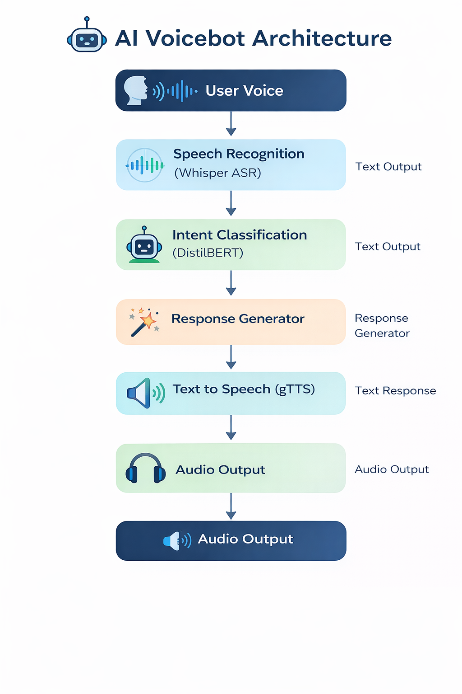
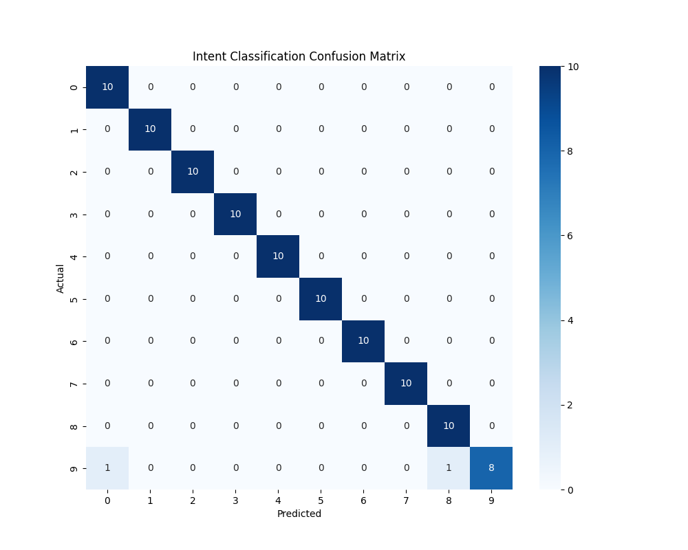

## System Architecture



## Model Cjoice Justification

-> Speech Recognition Model
We used OpenAI Whisper (base model) because:

1. robust to background noise
2. high accuracy for speech recognition
3. supports multiple accents
4. open-source and production-ready

-> Intent Classification Model
We used DistilBERT because:

1. lightweight transformer
2. faster inference than BERT
3. strong performance for text classification
4. suitable for real-time systems

-> Text-to-Speech
We used gTTS because:

1. simple API
2. natural sounding speech
3. lightweight and fast

## Setup Instructions:

1. Clone the repository
git clone <repo_url>

2. Navigate to project
cd voicebot-ai

3. Create virtual environment
python -m venv venv

4. Activate environment
venv\Scripts\activate

5. Install dependencies
pip install -r requirements.txt

6. Train intent model
python app/nlp/train_intent_model.py

7. Start the API
uvicorn app.main:app --reload

## Evaluation Metrics

Accuracy: 0.98
Precision: 0.9818181818181819
Recall: 0.98
F1 Score: 0.9793650793650792



Whisper ASR WER: 0.0


## API Usage Examples

The Voicebot system exposes multiple REST API endpoints using **FastAPI**.  
These endpoints allow interaction with each component of the system, including speech recognition, intent prediction, response generation, and text-to-speech synthesis.

The API can be accessed through Swagger UI:

```

[http://127.0.0.1:8000/docs](http://127.0.0.1:8000/docs)

```

---

### 1. Transcribe Audio (Speech to Text)

**Endpoint**

```

POST /api/transcribe

````

**Description**

Accepts an audio file (`.wav`) and converts speech to text using the Whisper ASR model.

**Example Request (cURL)**

```bash
curl -X POST "http://127.0.0.1:8000/api/transcribe" \
-F "audio=@sample_audio/cancel_order.wav"
````

**Example Response**

```json
{
  "transcription": "cancel my order"
}
```

---

### 2. Predict Intent

**Endpoint**

```
POST /api/predict-intent
```

**Description**

Predicts the customer intent from the provided text using the trained DistilBERT intent classifier.

**Example Request**

```bash
curl -X POST "http://127.0.0.1:8000/api/predict-intent?text=cancel%20my%20order"
```

**Example Response**

```json
{
  "intent": "cancel_order",
  "confidence": 0.92
}
```

---

### 3. Generate Response

**Endpoint**

```
POST /api/generate-response
```

**Description**

Generates a predefined customer support response based on the predicted intent.

**Example Request**

```bash
curl -X POST "http://127.0.0.1:8000/api/generate-response?intent=cancel_order"
```

**Example Response**

```json
{
  "intent": "cancel_order",
  "response": "I can help cancel your order. Please provide your order ID."
}
```

---

### 4. Text to Speech (TTS)

**Endpoint**

```
POST /api/synthesize
```

**Description**

Converts text into speech using the gTTS engine and returns an audio file.

**Example Request**

```bash
curl -X POST "http://127.0.0.1:8000/api/synthesize?text=Your%20order%20has%20been%20cancelled"
```

**Example Response**

Returns an audio file:

```
response.mp3
```

---

### 5. End-to-End Voicebot Interaction

**Endpoint**

```
POST /api/voicebot
```

**Description**

This endpoint performs the full pipeline:

Speech → Text → Intent → Response → Speech.

**Example Request**

```bash
curl -X POST "http://127.0.0.1:8000/api/voicebot" \
-F "audio=@sample_audio/cancel_order.wav"
```

**Example Response**

Returns an audio response file:

```
voicebot_response.mp3
```

---

### API Workflow

The complete request pipeline is:

```
Audio Input
   ↓
Whisper ASR (Speech to Text)
   ↓
Intent Classifier (DistilBERT)
   ↓
Response Generator
   ↓
Text-to-Speech (gTTS)
   ↓
Audio Response

```
This allows users to interact with the system using natural voice commands.

## Sample Audio Files

Example test audio files used for evaluating the system:

- [Cancel Order Audio](sample_audio/cancel_order.wav)
- [Refund Request Audio](sample_audio/refund_request.wav)
- [Order Status Audio](sample_audio/order_status.wav)

## Screenshots

All screenshots demonstrating the working of the system are available in the [screenshots](Screenshots/) folder.
